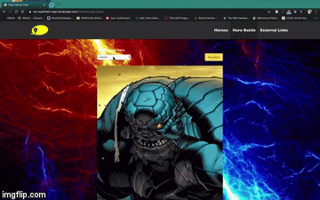

#  SEI45 - Project 02 (Frontend React App)
My second project for the General Assembly Software Engineering Immersive course. A frontend web application built in React that consumes a third-party API. This was a pair-programming exercise to be completed over the course of 2 days. My partner for the project was [Rory Fletcher](https://github.com/Fletch-7).

## Getting Started
### Installation
- Clone this repository by running the terminal command `git clone git@github.com:bheki-maenetja/sei-project-1.git`
- In the root folder run the terminal command `npm i` to install all necessary packages and modules
- To view the site locally run the terminal command `npm run start` and navigate to localhost:8000 in your browser.

### Deployment
- You can view a deployed version of the site [here](https://my-superhero-app.herokuapp.com/)

## Technologies Used
- React
- SASS/SCSS
- Bulma CSS Framework
- NodeJS
- Axios
- NPM
* Third-party APIs
  * [SuperHero API](https://akabab.github.io/superhero-api/api/)

## Overview
This project is a superhero information website. Users can search for their favourite superheroes (or supervillains) and find a wealth of information about their origins, connections, occupations and so much more. The site also includes a nifty comparison tool that allows users to compare the power stats of different superheroes.


<div style="display: flex; justify-content: space-between">
	<div style="width: 24%">
		<figcaption>Home Page</figcaption>
		
	</div>
	<div style="width: 24%">
		<figcaption>Hero Directory</figcaption>
		
	</div>
	<div style="width: 24%">
		<figcaption>Hero Information Page</figcaption>
		
	</div>
</div>

<div style="width: 100%">
		<figcaption>Hero Comparison Tool</figcaption>
		
</div>

## Approach
Given that this project was our first foray into ReactJS, it does lean heavily on React components. We carefully mapped out which React components would be needed for the different pages of the site. These included several reusable componenets such as the superhero search form and 'hero cards' which display the name of a superhero and their respective power stats.

### SuperHero API
- As stated in the project brief, one of the main requirements for the project is that it consumes a third-party API. For our project we chose the [SuperHero API](https://akabab.github.io/superhero-api/api/) published by [Yoann Criber](https://github.com/akabab). The API provides all the necessary data for the site. Requests to the API are made on the hero directory and hero display page.

### Hero Search Form
- The search form for the hero directory has a basic setting that allows users to search for superheroes by name, and an advanced setting the allows users to filter search results by gender, alignment, species and publisher. The user can switch between the basic and advanced setting at the push of a button 
- To implement the search functionality we built a seperate form component called HeroSearchForm. The component takes 4 props: a basic search function, an advanced search function, data for the advanced setting of the search form and a function to reset to the search parameters. In addition, it also takes the rest of the state variables from the HeroIndex component in a variable called stateVars.

```
// The Search form component
<HeroSearchForm 
 basicSearchFunction={this.basicSearchFunction}
 getAdvancedSearchData={this.getAdvancedSearchData}
 resetData={this.resetData}
 searchFunction={this.searchFunction}
 {...this.state}
/>

// Functionality for the basic & advanced search form
getPublishers = () => {
    const publishers = new Set()
    this.state.data.map(item => {
      const heroPublisher = item.biography.publisher
      if (!publishers.has(heroPublisher) && !!heroPublisher) publishers.add(heroPublisher)
    })
    return Array(...publishers)
  }

  getAlignments = () => {
    const alignments = new Set()
    this.state.data.map(item => {
      let heroAlignment = item.biography.alignment
      if (heroAlignment === '-') heroAlignment = 'neutral'
      if (!alignments.has(heroAlignment) && !!heroAlignment) alignments.add(heroAlignment)
    })
    return Array(...alignments)
  }

  getGenders = () => {
    const genders = new Set()
    this.state.data.map(item => {
      const heroGender = item.appearance.gender
      if (!genders.has(heroGender) && !!heroGender && heroGender !== '-') genders.add(heroGender)
    })
    return Array(...genders)
  }

  getRaces = () => {
    const races = new Set()
    this.state.data.map(item => {
      const heroRace = item.appearance.race
      if (!races.has(heroRace) && !!heroRace) races.add(heroRace)
    })
    return Array(...races)
  }

  getAdvancedSearchData = () => {
    const publishers = this.getPublishers()
    const alignments = this.getAlignments()
    const genders = this.getGenders()
    const races = this.getRaces()

    this.setState({ advancedSearchData: { publishers, alignments, genders, races }, displayAdvancedSearch: !this.state.displayAdvancedSearch })
  }

  basicSearchFunction = (e) => {
    const searchData = this.state.data.filter(item => item.name.toLowerCase().includes(e.target.value.toLowerCase()))
    this.setState({ searchData })
  }

  searchFunction = (e) => {
    const searchParams = this.state.advancedSearchParameters
    searchParams[e.target.name] = e.target.value
    const searchData = this.state.data.filter(item => (
      (item.biography.alignment === searchParams.alignment || !searchParams.alignment) && 
      (item.appearance.gender === searchParams.gender || !searchParams.gender) && 
      (item.appearance.race === searchParams.race || !searchParams.race) && 
      (item.biography.publisher === searchParams.publisher || !searchParams.publisher)
    ))
    this.setState({ searchData, advancedSearchParameters: searchParams })
  }

  resetData = () => {
    this.setState({ searchData: this.state.data, advancedSearchParameters: { race: '', gender: '', publisher: '', alignment: '' } })
  }
```

### Supehero Comparison Tool


