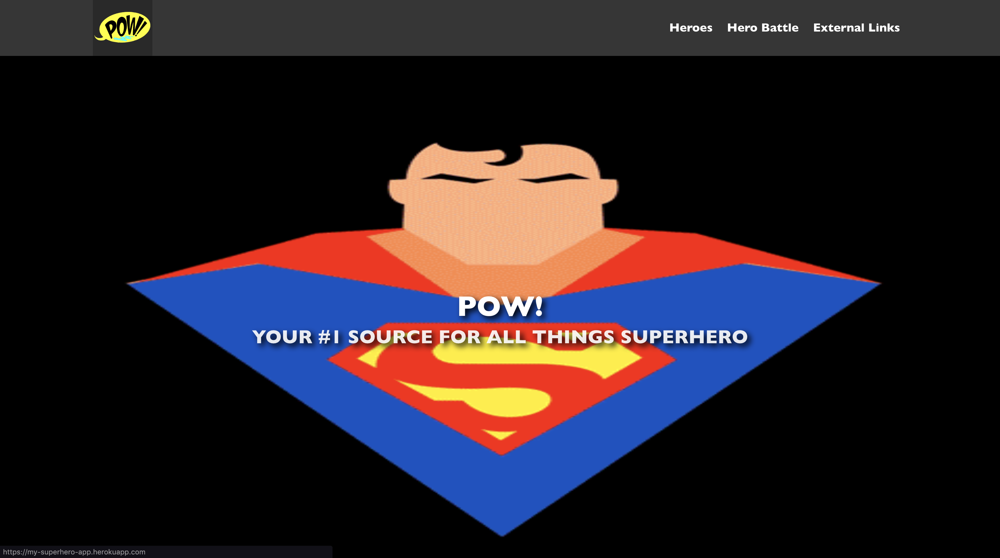

#  SEI45 - Project 02 (Frontend React App)
My second project for the General Assembly Software Engineering Immersive course. A frontend web application built in React that consumes a third-party API.

## Getting Started
### Installation
- Clone this repository by running the terminal command `git clone git@github.com:bheki-maenetja/sei-project-1.git`
- In the root folder run the terminal command `npm i` to install all necessary packages and modules
- To view the site locally run the terminal command `npm run start` and navigate to localhost:8000 in your browser.

### Deployment
- You can view a deployed version of the site [here](https://my-superhero-app.herokuapp.com/)

## Technologies Used
- React
- SASS/SCSS
- Bulma CSS Framework
- Axios
- NPM
* Third-party APIs
  * [SuperHero API](https://akabab.github.io/superhero-api/api/)

## How It Works
This project is a superhero information website. Users can search for their favourite superheroes (or supervillains) and find a wealth of information about their origins, connections, occupations and so much more. The site also includes a nifty comparison tool that allows users to compare the power stats of different superheroes.

	

		
		<figcaption>Home Page</figcaption>
	

	

		
		<figcaption>Hero Directory</figcaption>
	

	

		
		<figcaption>Hero Information Page</figcaption>
	

